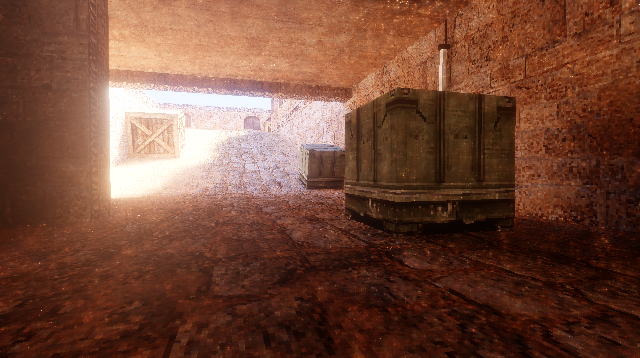

<h1>CelestiumPT 0.2: A CUDA-based Interactive Pathtracer</h1>

<h3>WORK IN PROGRESS ⚠</h3>
<code>The library is not yet usable for external applications</code>  
CelestiumPT is a <a href="https://developer.nvidia.com/cuda-zone#:~:text=CUDA%C2%AE%20is%20a%20parallel,harnessing%20the%20power%20of%20GPUs.">CUDA</a> based hobby pathtracer that is being developed for learning purposes and to be suitable for realtime applications. 
CelestiumPT can work on GPUs without hardware ray-tracing acceleration (tested on <code>GTX 1650 4GB</code>).

<h2><u>Building:</u></h2>
For now, the project can only be built via  visual studio(recommended: visual studio 2022); the <code>.sln</code> file is included in the project.

<h3>Dependencies:</h3>
<li>CUDA 12.4 toolkit

<h2><u>Features:</u></h2>
<ul>
<li>Two-level acceleration structure</li>
<li>A-SVGF denoiser</li>
<li>Diffuse materials</li>
<li>Albedo texturing</li>
<li>Multiple Importance Sampling</li>
<li>Basic random light sampler</li>
<li>Solid sky</li>
<li>COD:Advanced Warfare style bloom</li>
<li>AgX tonemapping</li>
<li>Histogram-based auto-exposure</li>
</ul>

<h2><u>Plans:</u></h2>
The plan is to make the pathtracer somewhat closer to the kind used by Quake2RTX.

<h3>Planned features:</h3>
<li>Metallic, glossy opaque dielectric materials</li>
<li>Full PBR textures input support</li>
<li>HDR environment map</li>
<li>FSR 2</li>
<li>Volumetrics</li>
<li>ReSTIR</li>
<li>more...</li>